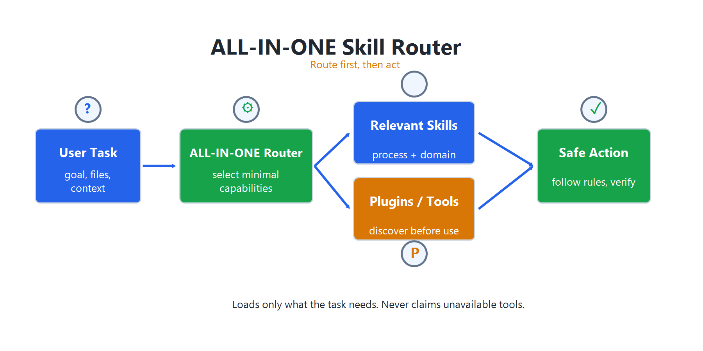

# ALL-IN-ONE Skill



ALL-IN-ONE 是一个轻量级的 AI Agent 技能总路由器。它会根据当前任务、对话上下文、显式提到的插件/应用、仓库状态和更高优先级规则，选择最小必要的 skills、插件、连接器和 MCP 工具。

它不是“全量加载器”。一次性加载所有 skill 或插件文档会浪费上下文，也更容易选错能力。ALL-IN-ONE 的核心规则是：先路由，再执行。

## 功能定位

- 读取用户目标、文件、显式 app/plugin 提及、当前模式、仓库上下文和约束。
- 先选择过程类技能，再选择领域类技能。
- 在使用插件、连接器或 MCP 工具前，先通过 `tool_search` 等运行时机制发现能力。
- 不假装未暴露的工具已经安装或启用。
- 简短说明本轮选择了哪些能力以及原因。

## 安装

把技能目录复制到用户级 skills 目录：

```powershell
Copy-Item -Recurse -Force .\skills\ALL-IN-ONE "$HOME\.agents\skills\ALL-IN-ONE"
```

期望结构：

```text
~/.agents/skills/ALL-IN-ONE/SKILL.md
```

Codex 也支持从 `~/.agents/skills/` 读取用户级技能。

## 使用方式

在任务开始时要求 Agent 使用 ALL-IN-ONE：

```text
Use ALL-IN-ONE for this task: fix the frontend bug and open a PR.
```

期望行为：

```text
Using ALL-IN-ONE to route this task: selected debugging/TDD, frontend, and GitHub capabilities because the task is a frontend fix with a PR publish step.
```

## 安全边界

ALL-IN-ONE 不会：

- 把所有 skills 或插件文档一次性加载进上下文。
- 自动安装插件。
- 绕过 system、developer、user、AGENTS.md、沙箱、安全策略、Plan Mode 或工具 schema。
- 假装不可用的 skill、连接器或工具已经存在。

## 文档

- [English README](README.md)
- [中英双语使用教程](docs/usage.md)
- [技能源码](skills/ALL-IN-ONE/SKILL.md)

## 许可证

MIT
